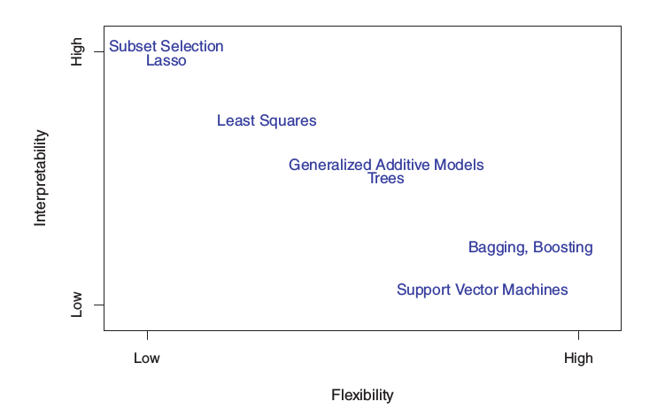

# Note - Introduction to Statistical Learning
## Chapter 2 Statistical Learning

### <font color=#0099ff>2.1 What Is Statistical Learning?</font>

<font size=3>

**Example**: TV, radio, newspaper -> sales

**Goal**: to develop an accurate model that can be used to predict sales on the basis of the three media budgets.

TV, radio, newspaper: predictor / independent variable / feature / variable  (X)
sales: response / dependent variable (Y)

> General form $Y = f(X)+\epsilon​$. $f​$ is some fixed but unkown function of $X_1​$,$X_2​$,...,$X_p​$ and $\epsilon​$ is a random error term, which is indenpendent of $X​$ and has mean zero.

</font>

#### <font color=#0099ff>2.1.1 Why Estimate f ?</font>
<font size=3>

Two reasons: <kbd>prediction</kbd> and <kbd>inference</kbd>

<kbd>Prediction</kbd>: input $X$ are readily available but $Y$ cannot be easily obtained. Focus on $Y$'s value. Treat $f$ as black box.
$$\hat{Y} = \hat{f}(X)$$
$$\underbrace{E(Y-\hat{Y})^2}_{\text{expected value}} = E[f(X)+\epsilon-\hat{f}(X)]^2=\underbrace{[f(X)-\hat{f}(X)]^2}_{\text{Reducible}}+\underbrace{Var(\epsilon)}_{\text{Irreducible}}$$
The accuracy of $\hat{Y}$ as a prediction of $Y$ depends on two quantities, reducible error and irriducible error.

<kbd>Inference</kbd>: how $Y$ is affected by the change of $X$. Focus on the fucntion $f$ instead of $Y$.

</font>

#### <font color=#0099ff>2.1.2 How Do We Estimate f ?</font>
<font size=3>

We observed a set of $n$ different data points <kbd>training data</kbd>. Goal is to find a function $\hat{f}$, such that $Y\approx \hat{f}(X)$ for any $(X,Y)$. Most statistical leanring methods is either <kbd>parametric</kbd> or <kbd>non-parametric</kbd>

<kbd>parametric</kbd>: 1. make assumption of function $f$, e.g. *liear model*; 2. use training data to fit/train the model, e.g. *(ordinary) least square*. **Advantage** is simplifed the problem of estimate $f$ to a set of parameters, $\beta_1,...,\beta_n$; **Disadvantage** is difficult to choose a match model.

<kbd>non-parametric</kbd>: estimate of $f$ that get close to data points as possible without being too rough or wiggly. **Advantage** is getting avoid the assumtion of function $f$; **Disadvantage** is not simplify the problem, so need a very large number of data points to obtain an accurate estimate for $f$.

</font>

#### <font color=#0099ff>2.1.3 The Trade-Off Between Prediction Accuracy and Model Interpretability</font>
<font size=3>



</font>

#### <font color=#0099ff>2.1.4 Supervised Versus Unsupervised Learning</font>
#### <font color=#0099ff>2.1.5 Regression Versus Classification Problems</font>
### <font color=#0099ff>2.2 Assessing Model Accuracy</font>
#### <font color=#0099ff>2.2.1 Measuring the Quality of Fit</font>
<font size=3>

<kbd>Mean Square Error (MSE)</kbd> $MSE = \frac{1}{n}\sum^{n}_{i=1}(y_i-\hat f(x_i))^2$
</font>

#### <font color=#0099ff>2.2.2 The Bias-Variance Trade-Off</font>
<font size=3>

$$E(y_0-\hat{f}(x_0))^2=Var(\hat{f}(x_0))+[Bias(\hat{f})x_0)]^2+Var(\epsilon)$$
In order to minimize the expected test error, we need select a statistical learning method that simutaneously archieves *low variance* and *low bias*.

<kbd>Variance</kbd> refers to the amount by which $\hat{f}$ would chagne if we estimate it using a different training data set. In general more flexiable statistical methods have higher variance.
Flexible method follows the training data strictly.

<kbd>Bias</kbd> refers to the error that is introduced by approximating a real-life problem by a much simpler model. In general more flexible statistical methods result in less bias.
</font>

#### <font color=#0099ff>2.2.3 The Classification Setting</font>
### <font color=#0099ff>2.3 Lab: Introduction to R</font>
#### <font color=#0099ff>2.3.1 Basic Commands</font>
<font size=3>

```r
  > x <- c(1,4,5,6)
  > length(x)
  > ls()
  > rm(x,y)  # remove variable x and y
  > rm(list=ls())  # remove all variables
  > x = matrix(data=c(1,2,3,4),nroow=2,ncol=2)
  > x = matrix(c(1,2,3,4),2,2)
  > x = matrix(c(1,2,3,4),2,2,byrow=TRUE)
  > sqrt(x)
  > rnorm(50)  # generate a vector of random variables
  > cor(x,y) # correlation between x and y
  > set.seed(1303)
  > mean() # mean
  > var() # variance
  > sd() # standard deviation
```
</font>

#### <font color=#0099ff>2.3.2 Graphics</font>
<font size=3>

```r
  > plot(x,y,xlab="",ylab="",main="")
  > pdf("figure.pdf")
  > jpeg("figure.jpeg")
  > seq(1,10,length=50) # generate a sequence of number
  > contour(x,y,z) # represent 3D data
  > image() # same as contour
  > persp(x,y,fa,theta=30,,phi=20) # same as contour but polar coordinate
```
</font>

#### <font color=#0099ff>2.3.3 Indexing Data</font>
<font size=3>

```r
  > A = matrix (1:16 ,4 ,4)
  > A
          [ ,1] [ ,2] [ ,3] [ ,4]
  [1 ,]
              1     5     9    13
  [2 ,]
              2     6    10    14
  [3 ,]
              3     7    11    15
  [4 ,]
              4     8    12    16
  > A [1 ,]
  [1] 1 5 9 13
  > A [ - c (1 ,3) ,] # delete rows
          [ ,1] [ ,2] [ ,3] [ ,4]
  [1 ,]       2     6    10    14
  [2 ,]       4     8    12    16
  > A [ - c (1 ,3) ,-c (1 ,3 ,4) ] # delete rows and columns
  [1]  6  8
  > dim(A)
  [1]  4  4
```
</font>

#### <font color=#0099ff>2.3.4 Loading Data</font>
<font size=3>

```r
  > Auto = read.table ("Auto.data")
  > fix(Auto) # view data in a spreadsheet like window.
  > Auto = read.table ("Auto.data", header=T) # first line contains variable name
  > Auto = read.table ("Auto.data", header=T, na.string="?")
  # if seeing a particular character or set of characters(such as '?'), treat as a missing elemtn of the data matrix
  > Auto = read.csv ("Auto.csv", header=T, na.string="?")
  > Auto = na.omit(Auto) # remove rows with missing observations
```
</font>

#### <font color=#0099ff>2.3.5 Additional Graphical and Numerical Summaries</font>
<font size=3>

```r
  > plot(Auto$cylinders, Auto$mpg)
  > attach(Auto) # make the variables in this data fram availabe by name
  > cylinders = as.factor(cylinders) # convert quantitative variables into qulitative variables
  > plot(cylinders,mpg,col="red",varwidth=T,horizontal=T)
  > hist(mpg,col=2,breaks=15) # histogram
  > paris(~mpg + displaement + horsepower + weight + acceleration, Auto) # scatterplot matrix
  > identify(horsepower,mpg,name)
  # provide a useful interactive method for identfying the value for a prticular variable for points on plot
  > summary()
  > savehistory()
  > loadhistory()
```
</font>

### <font color=#0099ff>2.4 Exercises</font>
